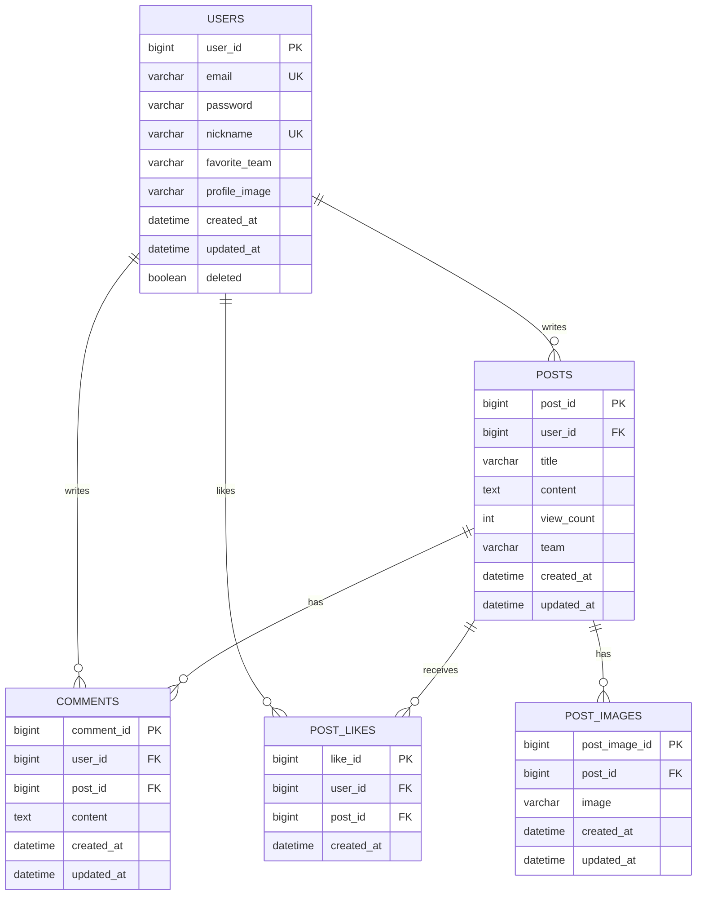

# BallTalk Back-end

KBO 팬들이 팀별 게시판에서 게시글, 댓글, 좋아요로 소통할 수 있도록 REST API를 제공하는 Spring Boot 서버입니다.

## 프로젝트 정보

- 프로젝트명: BallTalk Back-end
- 한 줄 설명: 세션 인증과 팀별 게시판을 제공하는 KBO 팬 커뮤니티 API
- 개발 기간: TODO
- Front-end GitHub Repository: TODO
- 서비스 시연 영상: TODO

## 사용 기술 및 Tools

| 구분 | 기술 |
| --- | --- |
| Language | Java 21 |
| Framework | Spring Boot 3.5.14 |
| Build Tool | Gradle 8.14.5 |
| Web | Spring Web |
| Validation | Spring Validation, Jakarta Validation |
| ORM | Spring Data JPA, Hibernate |
| Security | Spring Security, HTTP Session, BCrypt |
| Database | MySQL, H2 |
| Storage/CDN | AWS SDK for Java v2, Amazon S3, CloudFront |
| Boilerplate | Lombok |
| Test dependencies | Spring Boot Test, JUnit 5, Mockito, AssertJ |
| Container | Docker |

JWT, OAuth, Redis, QueryDSL과 Swagger/OpenAPI는 현재 프로젝트에 포함되어 있지 않습니다.

## 폴더 및 패키지 구조

```text
community/
├── src/
│   ├── main/
│   │   ├── java/com/lucan/community/
│   │   │   ├── CommunityApplication.java
│   │   │   ├── config/
│   │   │   │   ├── S3Config.java
│   │   │   │   ├── SecurityConfig.java
│   │   │   │   └── WebConfig.java
│   │   │   ├── controller/
│   │   │   │   ├── UserController.java
│   │   │   │   ├── PostController.java
│   │   │   │   ├── CommentController.java
│   │   │   │   └── S3Controller.java
│   │   │   ├── dto/
│   │   │   │   ├── user/
│   │   │   │   ├── post/
│   │   │   │   ├── comment/
│   │   │   │   ├── like/
│   │   │   │   └── response/
│   │   │   ├── entity/
│   │   │   ├── enums/
│   │   │   ├── exception/
│   │   │   ├── message/
│   │   │   ├── repository/
│   │   │   ├── security/
│   │   │   └── service/
│   │   └── resources/
│   │       ├── application.properties
│   │       ├── application-local.properties
│   │       └── application-prod.properties
│   └── test/
├── k6-tests/
├── build.gradle
├── Dockerfile
└── README.md
```

## 서버 설계

서버는 역할에 따라 Controller, Service, Repository, Entity 계층으로 구성되어 있습니다.

```text
HTTP Request
  → Spring Security Filter Chain
  → Controller
  → Service
  → Repository
  → JPA Entity
  → Database
```

### Controller

HTTP 요청을 받고 DTO 검증과 응답 생성을 담당합니다.

| Controller | 책임 |
| --- | --- |
| `UserController` | 회원가입, 내 정보 조회·수정, 비밀번호 변경, 회원 탈퇴 |
| `PostController` | 게시글 목록·상세·작성·수정·삭제, 최신글·인기글, 조회수, 좋아요 |
| `CommentController` | 게시글 댓글 조회·작성·수정·삭제 |
| `S3Controller` | multipart 이미지 업로드 |

대부분의 API는 다음 공통 응답 객체를 사용합니다.

```json
{
  "message": "message_code",
  "data": {}
}
```

### Service

트랜잭션과 비즈니스 규칙을 담당합니다.

- `UserService`: 중복 검사, 비밀번호 암호화, 회원정보 변경, 회원 탈퇴
- `PostService`: 게시글 CRUD, 목록 집계, 인기글·최신글, 조회수, 좋아요
- `CommentService`: 댓글 CRUD와 작성자 권한 검증
- `S3Service`: 이미지 검증, S3 업로드·삭제, CloudFront URL 생성

조회 메서드는 `readOnly = true`, 변경 메서드는 일반 트랜잭션으로 실행됩니다.

### Repository

Spring Data JPA의 `JpaRepository`를 사용합니다.

- 게시글 목록은 JPQL 생성자 표현식으로 화면에 필요한 DTO를 직접 조회합니다.
- `COUNT(DISTINCT ...)`로 게시글별 좋아요 수와 댓글 수를 집계합니다.
- 댓글 목록도 Entity 전체가 아닌 `CommentListResponse`로 직접 조회합니다.
- 사용자와 게시글 조합으로 좋아요 존재 여부를 확인합니다.

### Entity

| Entity | 테이블 | 역할 |
| --- | --- | --- |
| `User` | `users` | 계정, 응원팀, 프로필, 탈퇴 여부 |
| `Post` | `posts` | 팀 게시판 게시글과 조회수 |
| `Comment` | `comments` | 게시글 댓글 |
| `PostLike` | `post_likes` | 사용자별 게시글 좋아요 |
| `PostImage` | `post_images` | 게시글 이미지 URL |

모든 연관관계는 자식 Entity에서 부모 Entity를 참조하는 단방향 `ManyToOne`이며 LAZY 로딩을 사용합니다. Entity cascade는 설정하지 않았고, 게시글 삭제 시 Service에서 연관 데이터를 직접 삭제합니다.

## 주요 기능

### Users

- 이메일 형식, 비밀번호 길이, 닉네임 길이 검증
- 이메일과 닉네임 중복 방지
- BCrypt 비밀번호 암호화
- 응원팀과 선택적 프로필 이미지가 포함된 회원가입
- 로그인 사용자 정보 조회
- 닉네임과 프로필 이미지 개별 또는 동시 수정
- 현재 비밀번호 검증 후 새 비밀번호로 변경
- 프로필 이미지가 있으면 S3 객체 삭제 후 회원 탈퇴
- 회원 레코드를 삭제하지 않고 `deleted = true`로 변경하는 soft delete
- 탈퇴 시 닉네임을 `탈퇴 유저`로 변경하고 HTTP 세션 무효화

### Posts

- 전체 또는 팀별 게시글 목록 조회
- `page`, `size` 기반 페이지네이션
- 작성일 내림차순 정렬
- 목록에서 좋아요 수, 댓글 수, 조회수 제공
- 게시글 상세와 이미지, 작성자 프로필, 집계 정보 제공
- 로그인 사용자의 응원팀 최신 게시글 3개 제공
- 응원팀 인기 게시글 3개 제공
- 제목 최대 26자 검증
- 선택적 이미지가 포함된 게시글 작성
- 작성자만 제목, 내용, 이미지를 수정 가능
- 작성자만 게시글과 연관 댓글·좋아요·이미지를 삭제 가능
- 세션과 `X-View-Event-Id`를 이용한 동일 조회 이벤트 중복 처리 방지

인기글 정렬 기준은 좋아요 수, 조회수, 작성일의 내림차순입니다.

### Comments

- 게시글별 댓글을 최신 작성 순으로 조회
- 빈 댓글 작성·수정 방지
- 댓글이 요청한 게시글에 속하는지 검증
- 댓글 작성자만 수정·삭제 가능

### Likes

- 게시글 좋아요와 좋아요 취소
- 좋아요 처리 후 현재 좋아요 수 반환
- Repository 검사와 DB 유니크 제약으로 중복 좋아요 방지

### Images

- 프로필 이미지와 게시글 이미지 업로드
- MIME type이 `image/`로 시작하는 파일만 허용
- UUID 기반 S3 object key 생성
- 이미지 교체 시 기존 S3 객체 삭제
- 게시글 삭제와 회원 탈퇴 시 관련 이미지 삭제
- 최대 파일 및 요청 크기 10MB

### Team 관련 기능

지원하는 팀 enum은 다음 10개입니다.

```text
LG, KT, SSG, NC, KIA, SAMSUNG, LOTTE, DOOSAN, HANWHA, KIWOOM
```

- 회원가입 시 응원팀 선택
- 게시글 작성 시 팀 게시판 선택
- 특정 팀의 게시글 목록 필터링
- 로그인 사용자의 응원팀을 기준으로 최신글·인기글 제공
- 작성자와 댓글 작성자의 응원팀 정보 제공

## Spring Security 인증 및 인가

### 인증 흐름

```text
POST /users/login
  → Spring Security formLogin
  → CustomUserDetailsService.loadUserByUsername(email)
  → UserRepository.findByEmail(email)
  → BCrypt 비밀번호 검증
  → SecurityContext를 HTTP Session에 저장
  → 이후 JSESSIONID 쿠키로 인증 유지
```

- 로그인 처리 URL: `/users/login`
- 사용자명 파라미터: `email`
- 비밀번호 파라미터: `password`
- 로그아웃 URL: `/users/logout`
- 기본 권한: `ROLE_USER`
- 탈퇴한 사용자는 로그인 거부
- 미인증 요청은 `401 Unauthorized` 반환
- CSRF 비활성화
- CORS credential 허용

공개 경로:

- `/users/signup`
- `/users/login`
- `/h2-console/**`
- `/css/**`
- `/Js/**`
- `/images/**`
- `GET /posts`

그 밖의 요청은 인증이 필요합니다. 게시글과 댓글의 소유권은 role이 아니라 Service 계층에서 로그인 사용자 ID와 작성자 ID를 비교해 검증합니다. 현재 소유권 위반도 커스텀 `UnauthorizedException`을 통해 401로 처리됩니다.

## 데이터베이스 설계

### Entity 관계

```text
User 1 ── N Post
User 1 ── N Comment
User 1 ── N PostLike
Post 1 ── N Comment
Post 1 ── N PostLike
Post 1 ── N PostImage
```

애플리케이션은 게시글 이미지를 `findByPost()`로 단건 조회하므로 기능상 게시글당 이미지 한 장을 사용합니다. 다만 `post_images.post_id`에는 DB 유니크 제약이 선언되어 있지 않습니다.

### 테이블 요약

| 테이블 | 주요 컬럼 및 제약 |
| --- | --- |
| `users` | `user_id` PK, `email` UNIQUE, `nickname` UNIQUE, `favorite_team` NOT NULL, `deleted` |
| `posts` | `post_id` PK, `user_id` FK, `title`, `content` TEXT, `team` NOT NULL, `view_count` |
| `comments` | `comment_id` PK, `user_id` FK, `post_id` FK, `content` TEXT |
| `post_likes` | `like_id` PK, `user_id` FK, `post_id` FK, `(user_id, post_id)` UNIQUE |
| `post_images` | `post_image_id` PK, `post_id` FK, `image` |

각 Entity는 `createdAt`을 생성 시 설정하며, `User`, `Post`, `Comment`, `PostImage`는 수정 시각도 관리합니다.

### ERD



## 주요 API 명세

인증 표기에서 `작성자`는 로그인과 소유권 검증이 모두 필요하다는 의미입니다.

### Users

| Method | URI | 인증 | 요청 형식 | 설명 |
| --- | --- | --- | --- | --- |
| `POST` | `/users/signup` | 공개 | multipart/form-data | 회원가입 |
| `POST` | `/users/login` | 공개 | form-urlencoded | 로그인 |
| `POST` | `/users/logout` | 필요 | - | 로그아웃 |
| `GET` | `/users/me` | 필요 | - | 내 정보 조회 |
| `PATCH` | `/users/me` | 필요 | multipart/form-data | 닉네임·프로필 수정 |
| `PATCH` | `/users/me/password` | 필요 | JSON | 비밀번호 변경 |
| `DELETE` | `/users/me` | 필요 | - | 회원 탈퇴 |

로그인은 Controller가 아닌 Spring Security 필터가 처리합니다.

### Posts and Likes

| Method | URI | 인증 | 요청 형식 | 설명 |
| --- | --- | --- | --- | --- |
| `GET` | `/posts?team=&page=0&size=10` | 공개 | Query String | 게시글 목록 |
| `GET` | `/posts/recent` | 필요 | - | 응원팀 최신글 3개 |
| `GET` | `/posts/popular` | 필요 | - | 응원팀 인기글 3개 |
| `GET` | `/posts/{postId}` | 필요 | - | 게시글 상세 |
| `POST` | `/posts/{postId}/views` | 필요 | Header | 조회수 증가 |
| `POST` | `/posts` | 필요 | multipart/form-data | 게시글 작성 |
| `PATCH` | `/posts/{postId}` | 작성자 | multipart/form-data | 게시글 수정 |
| `DELETE` | `/posts/{postId}` | 작성자 | - | 게시글 삭제 |
| `POST` | `/posts/{postId}/likes` | 필요 | - | 좋아요 |
| `DELETE` | `/posts/{postId}/likes` | 필요 | - | 좋아요 취소 |

게시글 작성 필드는 `title`, `content`, `team`, 선택적 `imageFile`입니다. 수정에서는 `title`, `content`, `imageFile` 가운데 하나 이상을 전달해야 하며 팀 변경과 기존 이미지 단독 삭제는 지원하지 않습니다.

조회수 증가 요청에는 `X-View-Event-Id` 헤더가 필요합니다.

### Comments

| Method | URI | 인증 | 요청 형식 | 설명 |
| --- | --- | --- | --- | --- |
| `GET` | `/posts/{postId}/comments` | 필요 | - | 댓글 목록 |
| `POST` | `/posts/{postId}/comments` | 필요 | JSON | 댓글 작성 |
| `PATCH` | `/posts/{postId}/comments/{commentId}` | 작성자 | JSON | 댓글 수정 |
| `DELETE` | `/posts/{postId}/comments/{commentId}` | 작성자 | - | 댓글 삭제 |

댓글 작성·수정 본문:

```json
{
  "content": "댓글 내용"
}
```

### Images

| Method | URI | 인증 | 요청 형식 | 설명 |
| --- | --- | --- | --- | --- |
| `POST` | `/images` | 공개 | multipart/form-data | 이미지 업로드 |

필수 필드는 `file`이며 `directory`는 선택 사항입니다. 서비스가 반환하는 값은 CloudFront 기반 이미지 URL입니다.

### 오류 응답

| 예외 | HTTP 상태 |
| --- | ---: |
| 잘못된 요청 및 DTO 검증 실패 | 400 |
| 인증 실패 및 소유권 위반 | 401 |
| 리소스 없음 | 404 |
| 이메일·닉네임·좋아요 중복 | 409 |
| 처리되지 않은 서버 오류 | 500 |

## 인덱스 및 조회 성능 관련 구현

### DB 인덱스

| 테이블 | 인덱스 |
| --- | --- |
| `posts` | `created_at` |
| `posts` | `(team, created_at)` |
| `comments` | `(post_id, created_at)` |
| `post_likes` | `post_id` |
| `post_likes` | `(user_id, post_id)` UNIQUE |

### 조회 구현

- 전체·팀별 게시글은 `Pageable`을 사용해 DB에서 페이지 단위로 조회합니다.
- 게시글 목록은 JPQL DTO projection을 사용합니다.
- 좋아요와 댓글을 LEFT JOIN하고 `COUNT(DISTINCT ...)`로 중복 집계를 방지합니다.
- 최신글과 인기글은 `PageRequest.of(0, 3)`으로 최대 3개만 조회합니다.
- 댓글 목록은 `post_id`로 필터링하고 작성일 내림차순으로 정렬합니다.
- JPA 연관관계는 LAZY 로딩을 사용합니다.
- 게시글 조회수 이벤트는 같은 HTTP 세션에서 같은 이벤트 ID가 반복 처리되지 않도록 세션 속성으로 기록합니다.

## AWS S3 / CloudFront 이미지 처리

`S3Config`는 AWS SDK v2의 `S3Client`를 만들며 인증정보는 `DefaultCredentialsProvider`를 통해 조회합니다. 접근 키나 비밀번호는 소스코드에 직접 작성하지 않습니다.

```text
MultipartFile
  → 파일 존재 여부 및 image MIME type 검사
  → directory/UUID.extension object key 생성
  → S3 putObject
  → CloudFront domain/object-key URL 반환
  → Entity에 URL 저장
```

사용 디렉터리:

- 프로필 이미지: `profiles/`
- 게시글 이미지: `posts/`

이미지 URL에서 path를 추출해 S3 object key로 사용하며, 교체·회원 탈퇴·게시글 삭제 시 `deleteObject`를 호출합니다.

필요한 설정 항목은 리전, S3 bucket, CloudFront domain과 AWS SDK가 인식할 수 있는 인증정보입니다. 실제 값은 README에 포함하지 않습니다.

## Docker 및 배포

Back-end Dockerfile은 멀티 스테이지 빌드를 사용합니다.

```text
eclipse-temurin:21-jdk
  → Gradle bootJar 생성
  → eclipse-temurin:21-jre
  → java -jar app.jar
```

- 컨테이너 포트: `8080`
- Docker 이미지 빌드 시 테스트 제외
- Compose 서비스명: `backend`
- Compose가 루트 `.env`를 Back-end 컨테이너에 전달
- 컨테이너 timezone: `Asia/Seoul`

Database profile:

| Profile | Database | DDL 설정 |
| --- | --- | --- |
| `local` | In-memory H2 | `create` |
| `prod` | MySQL | `update` |

MySQL 연결 정보는 `prod` 프로필에서 환경변수로 주입됩니다. 현재 루트 `docker-compose.yml`은 `SPRING_PROFILES_ACTIVE`를 직접 선언하지 않으므로, MySQL 운영 환경에서는 `prod` 프로필 활성화가 별도로 필요합니다. Compose에는 DB 컨테이너와 Back-end health check가 포함되어 있지 않습니다.

로컬 실행:

```bash
./gradlew bootRun --args='--spring.profiles.active=local'
```

Docker Compose 실행은 프로젝트 루트에서 수행합니다.

```bash
docker compose up --build
```

## 트러블 슈팅

TODO

## 프로젝트 후기

TODO
